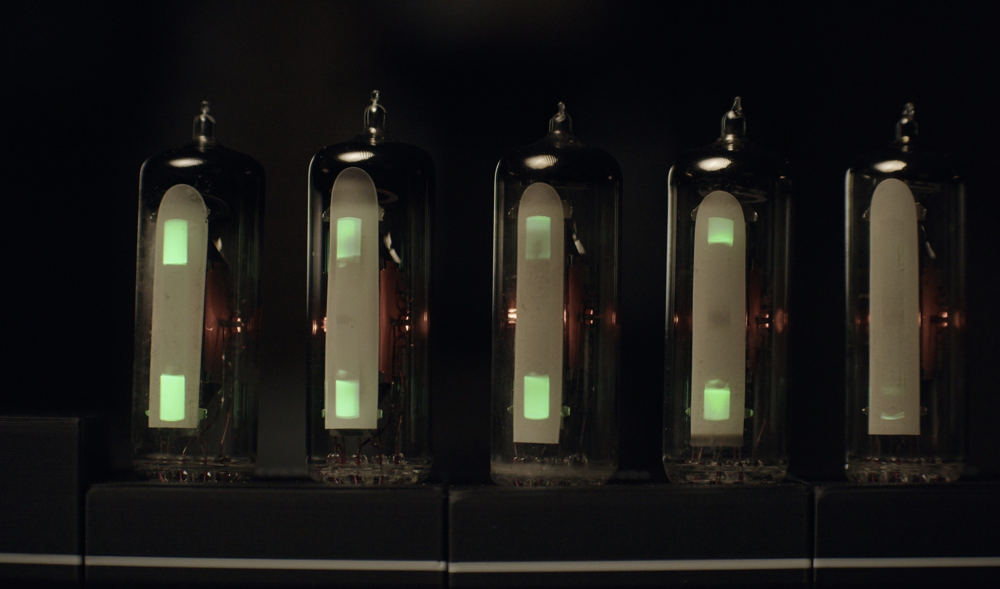
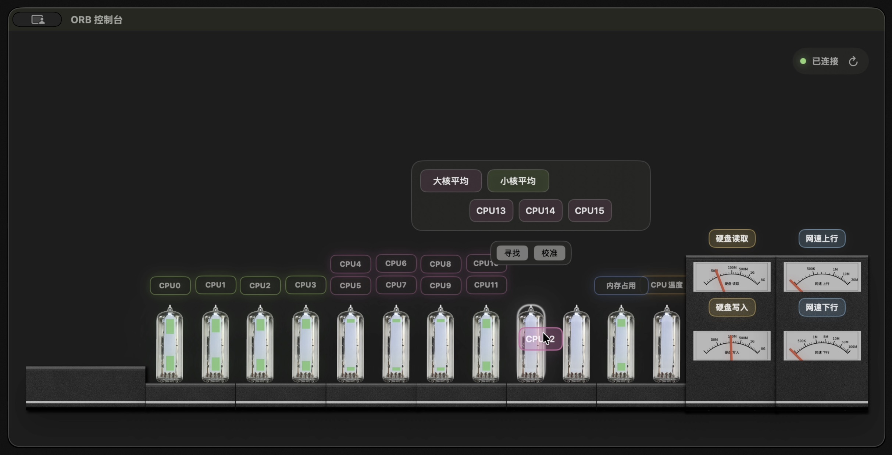
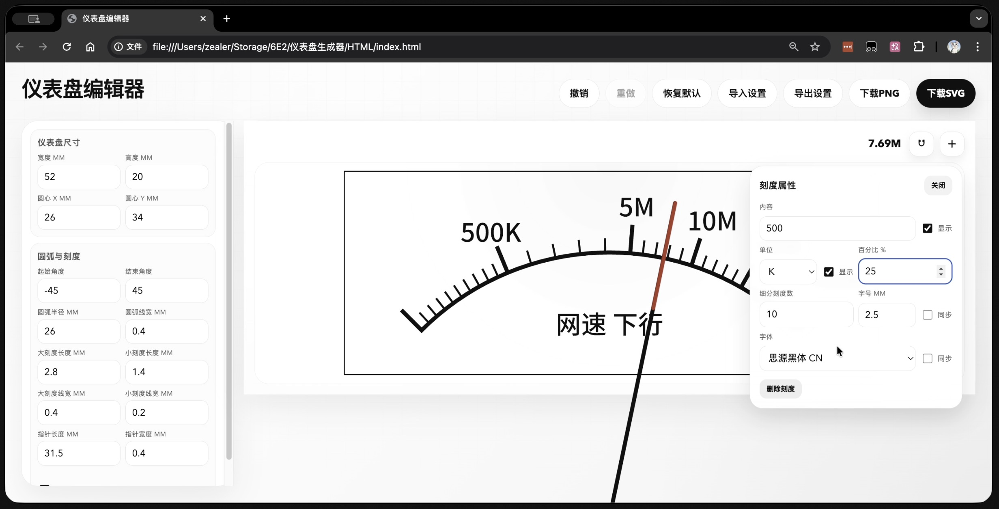
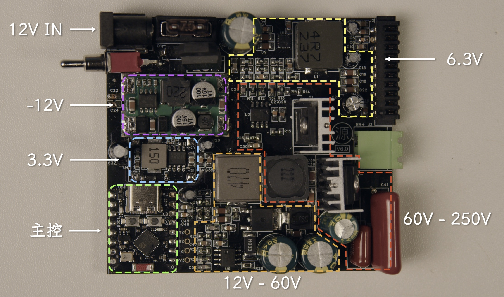
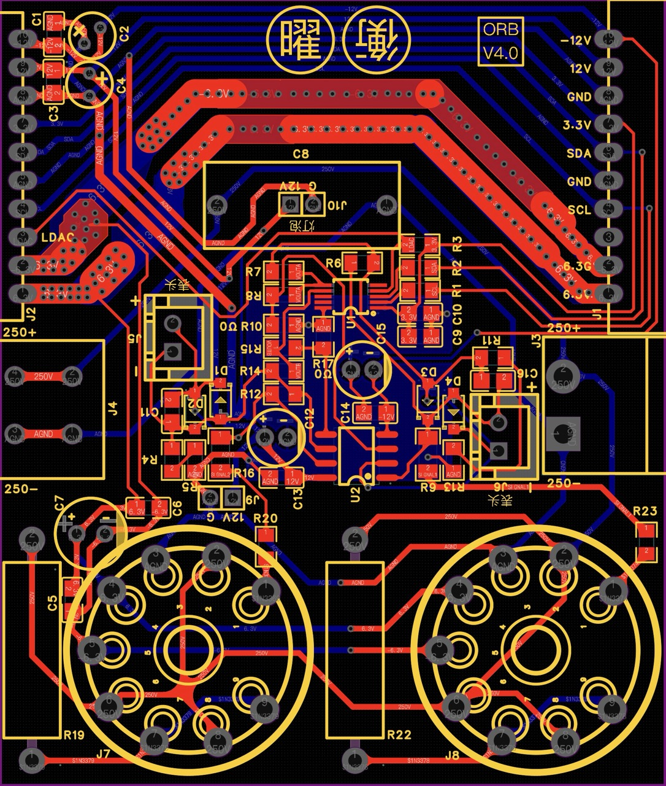

# ORB

ORB 是一套开源模块化桌面性能指示系统：使用 6E2 真空管和指针式仪表，实时监控 CPU 负载、内存压力、硬盘读写、网速等信息。



## 系统架构

ORB 由三种模块组成：

| 模块 | 名称 | 功能 |
| --- | --- | --- |
| 源 | Origin | 电源 + 主控 |
| 曜 | Radiance | 真空管模块 |
| 衡 | Balance | 指针仪表模块 |

你需要：

- 源 x 1（必须）
- 曜 / 衡 x N（自由组合）

ORB 最多支持 8 个拓展模块（即 16 个显示单元）。

## 首次启动

新设备首次启动时，先单独给源模块上电。  
源模块会发射一个热点，用手机连接这个热点，并在设置页中填写 SSID、密码，即可将源模块接入 Wi-Fi。  
随后，打开电脑客户端，客户端会识别到局域网中的源模块，并自动连接。

## 模块注册

曜/衡模块通过 I2C 协议与源模块通信。  
曜/衡模块首次连接源模块时，需逐一注册，并分配 I2C 地址，具体操作如下：

- 将**一个**新的曜/衡模块连接至源模块，上电开机。
- 客户端识别到新设备后，会弹出提示，用户添加设备后，即注册成功。
- 断电，插入下一个新模块，开机，继续注册剩余模块。

**注意：每次只能注册 1 个模块，不能同时注册多个新模块。I2C 设备不支持热拔插，请先插入新的模块后，再开机上电，否则系统无法识别新设备。**

I2C 地址分配规则：

曜/衡模块使用的 DAC 拥有 8 个可写的 I2C 地址，因此 ORB 最多可以同时连接 8 个模块。  
DAC 出厂的默认地址是 `0x60`，当源模块识别到地址为 `0x60` 的 I2C 设备时，即会判断为新模块。  
新模块注册时，系统会将该新设备分配一个 `0x61` - `0x67` 的地址。  
第 8 个模块会被分配为默认的 `0x60`。  
如 `0x60` - `0x67` 全部被占用，再插入新的模块，系统将不再识别，也无法控制这个模块。

如出现误操作，为模块写入了重复的地址，请删除该模块并重新添加，或在维护模式中，手动为指定模块写入 I2C 地址。  

I2C 注册表会保存在 MCU 中。如果更换上位机，相关设置也会保留。

## 模块校准

因不同电子管厂生产的 6E2 一致性较差，建议在模块注册后，进行一次校准。  
在客户端中选中某根电子管，点击 `校准`（如果不确定选中的是哪根电子管，可以点击 `寻找`，对应的电子管会亮起）。  
跟随客户端提示，依次将电子管指示条手动设置到 50%、0%、25%、100%、75%，即可完成校准。  
每根电子管只需校准 1 次，校准文件会保存在 MCU 中。更换新的电子管后，需再次进行校准。

衡模块的指针仪表，校准流程同曜模块。

## 客户端操作

在客户端中，你可以所见即所得地设置各个模块。

- 将要显示的参数拖动到电子管/仪表上，即可设置每个模块的显示内容。如一根电子管上绑定了多个CPU核心，则会取平均值。
- 电子管/仪表上的读数，与模块上实际显示的读数同步更新。
- 拖拽模块可以重新排列它们的顺序。



### 衡模块的仪表盘设置

用衡模块监控硬盘读写、网速时，建议使用非线性刻度仪表盘，以更有效地利用表盘空间。  
你可以根据自己的硬盘读写速度、宽带速度，使用 `tools/gauge_designer` 中的编辑器，定制你的仪表盘。  



仪表盘制作完成后，可将配置文件导出，并直接在客户端中使用。  
仪表盘生成器可以导出 PNG 或 SVG 图片，将其 1:1 打印并粘贴到衡模块的外壳上，即可直接使用。

## 仓库结构

```text
ORB/
  client/
    macos/         macOS 客户端
    windows/       Windows 客户端（待填坑）
  firmware/
    ORB_ESP32C3/   ESP32C3 主控固件
  hardware/
    case/          外壳文件
    pcb/           PCB、Gerber、BOM、SMD 文件
  tools/
    gauge_designer/ 仪表盘生成工具
    localization/   多语言导出脚本
  locales/         多语言源文件
```

## 硬件部分

### 6E2 电子管
6E2 是一种旁热式氧化物阴极调谐指示管，其工作原理与 CRT 显示器类似，使用电子束轰击荧光材料发光。

向 6E2 栅极（pin 1）输入 0V 至 -10V 的控制信号，即可改变偏转电极的电位，从而控制荧光屏指示条的开合。  
栅极电压越高（接近 0V），指示条越闭合（光条越长）；栅极电压越低（越负），指示条越打开（光条越短）。

控制链如下：

```上位机 → ESP32 → DAC（转模拟信号） → 运放（反相 + 放大） → 6E2 栅极```

曜模块上的 R19, R22 的阻值（默认为390KΩ）将影响无信号输入时，荧光屏上光条的长度。  
不同管厂生产的 6E2 可能存在较大个体差异，导致需要的阻值可能不同。  
经测试，390KΩ的电阻已经可以适配大部分 6E2。  如果你的电子管经校准后，光条依然无法完全打开、或完全闭合，可尝试增加或减少这个电阻的阻值。

### 源模块
源模块是整个系统的主控和电源。



ORB 的系统输入电压为 12V，请使用输出能力大于 12V 3.5A 的电源为 ORB 供电。  
MCU 为 ESP32C3 Supermini 模块，通过Wi-Fi和上游客户端通信，通过 i2c 协议控制下游模块。  

#### 源模块的散热（重要）：

在连接模块较多时，源模块会存在较大散热压力。主要发热器件有（按散热压力排序）：

- Q1 FQPF8N60C MOS 管
- D5 STTH8R06D 二极管
- U1 TPS568230RJER 芯片
- Q2 FQD13N10LTM MOS 管
- D4 SS5150C 二极管

其中，前三个器件的温度需重点关注。  
Q1 和 D5 均预留了 TO-220 散热片孔位，请务必安装。

如需连接 6 个或以上曜模块（即 12 根电子管），250V 升压部分的功率 MOS 管 Q1 FQPF8N60C 将超过 100°C，请务必加装风扇。  
加装风扇后，在长期使用前，请持续监测 Q1 FQPF8N60C MOS 管、D5 STTH8R06D 二极管、U1 TPS568230RJER 芯片的温度，防止器件过热损坏。  

#### 射频和通信

ORB 使用 ESP32C3 Supermini 模块上的贴片天线与上位机通信。  
在测试中，大部分时候，射频收发均正常，但偶现 Wi-Fi 无法正常连接、或无法正常发射热点的无法情况。  
如出现信号不佳，或周边电磁环境较为复杂，也可选购带 ipex 接口的 ESP32C3 Supermini 模块，将射频引出至外置天线上。

### 曜/衡模块
曜和衡模块共用同一块 PCB 板，焊接不同的外围电路，即可实现不同的功能。



当作曜模块使用时：  
· 将 R10, R17 焊盘短接；  
· J5, J6, C11, C16, D1, D2, D3, D4, R4, R5, R8, R11, R13, R15 留空不焊。

当作衡模块使用时：
· 将 R10, R17 焊盘断开；  
· R6, R7, R9, R12, R14, R16 留空不焊；  
· 250V 总线的 J3, J4, C8 留空不焊；  
· R19, R20, R22, R23, J7, J8，即电子管管座部分所有器件留空不焊；  
· C5, C6, C7留空不焊。

PCB 板上也用不同方向的丝印做了区分：  
正向丝印为曜模块电路；  
反向丝印为衡模块电路；  
侧向丝印为公用电路。

J9、J10为 12V 灯泡焊盘（可选），可外接暖色钨丝灯，用于仪表盘照明，让氛围更为复古。


## 安全提示

**驱动电子管的 250V 有致命风险。**   

在制作、使用 ORB 时，请时刻遵循如下规则：

- **电子管不支持热拔插。所有模块也不支持热拔插。** 热拔插带来的电弧可能会带来风险。
- **在增加或移除任何模块前，请先断电，并静置10秒后，再进行操作。** 设备内部的电容需要 10 秒方可泄放至安全电压。如在泄放完成前就提前移除设备，电容中的余电可能会引发电击。
- 设备运行时，或设备断电后10秒内，请勿触碰主板元件中的任何金属部分。
- 如非必要，不要带电操作。如必须带电操作，尽量单手操作，避免形成手到手回路，导致电流流经胸腔。

## 待填坑

- 通信鉴权，局域网内多设备共存
- 多语言支持


## ⭐ Star History

<p align="center">
  <a href="https://star-history.com/#dai-hongtao/ORB&Timeline">
    
  </a>
</p>
