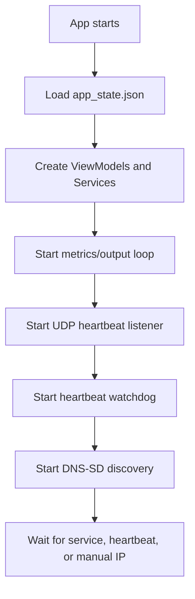

# State And Workflows

## 1. Root State

根状态对应 Mac `AppModel`，但 Windows 实现时建议拆分。必须可观察的状态：

```text
AppLanguage
ConnectionStatus
DeviceState
DiscoveredServices
RefreshInterval
MotionDurationFactor
MotionDraftDurationFactor
SystemMetrics
SelectedModuleId
ShowingMaintenanceScreen
SelectedUnknownAddress
ActiveCalibration
PendingUnknownModuleType
PendingUnknownModuleId
UnknownDeviceNotice / Issue / IsBusy
ModuleActionNotice / Issue
I2CDebugSourceAddress / TargetAddress / IsScanning / IsWriting / Notice / Issue
SelectedFirmwarePath / IsUploadingFirmware / UploadNotice / UploadIssue
LocatingChannelKey
PendingCalibrationStartKey
LatestHeartbeat
HeartbeatListenerStatus
HeartbeatRoutingIssue
LocalNetworkAccessIssue
SmoothingActionIssue
MotionDraftProfiles
IsApplyingMotionSettings
MotionApplySuccessNotice
ReconnectStatusNotice
IsArrangingModules
```

内部状态：

```text
Layout
ModuleSettings
CalibrationLuts
ActiveEndpoint
HasBootstrapped
AutoConnectName
OutputFrameId
LastDeviceContactAt
LastAppliedStateRevision
LastLivenessProbeAt
HasLocalMotionDraftEdits
```

## 2. Persisted State

路径：

```text
%APPDATA%\ORB\app_state.json
```

Schema：

```json
{
  "layout": [
    {"id": "source", "position": 0, "moduleID": null, "kind": "source"},
    {"id": "module-1", "position": 1, "moduleID": 1, "kind": "module"}
  ],
  "moduleSettings": [
    {
      "moduleID": 1,
      "moduleType": 1,
      "channelBindings": [
        {
          "channelIndex": 0,
          "metric": {
            "kind": "cpuCoreAverage",
            "coreIndices": [0, 1],
            "userAssigned": false,
            "scalePoints": []
          }
        }
      ]
    }
  ],
  "refreshInterval": 0.5,
  "motionDurationFactor": 0.7,
  "calibrationLUTs": [],
  "appLanguage": "system"
}
```

兼容规则：

- `layout` 缺失或空：默认 `[source]`。
- `refreshInterval` 缺失：`0.5`。
- `motionDurationFactor` 缺失：`0.7`。
- `appLanguage` 缺失：`system`。
- `ModuleSetting.binding` legacy 单绑定：扩展为两个通道。
- `CalibrationLUT` 缺 `channelIndex`：视为 legacy shared LUT，迁移为通道 0 和 1。

保存时机：

- 语言改变。
- 刷新周期改变。
- 模块排序改变。
- 通道绑定改变。
- 校准 LUT 保存。
- state load 后完成 layout/settings merge。

## 3. Derived State

### 3.1 SourceIsOnline

```text
LastDeviceContactAt != null &&
Now - LastDeviceContactAt <= OfflineGraceWindow
```

### 3.2 HeartbeatGraceWindow

```text
interval = LatestHeartbeat.HeartbeatIntervalMs ?? DeviceState.HeartbeatIntervalMs ?? 1500
HeartbeatGraceWindow = max(interval / 1000 * 3.2, 2.5)
```

### 3.3 OfflineGraceWindow

```text
OfflineGraceWindow = HeartbeatGraceWindow + max(HeartbeatGraceWindow * 0.75, 3.0)
```

### 3.4 ConnectionStatus

```text
if SourceIsOnline -> Online
else if DeviceState != null || ActiveEndpoint != null || LatestHeartbeat != null -> Offline
else -> NotFound
```

## 4. Bootstrap Workflow

启动流程：



Windows 没有 macOS 本地网络授权 primer，但需要准备防火墙说明：

- 首次 UDP 监听可能出现 Windows Defender Firewall 提示。
- UI 顶部可在检测到 UDP 不可用或一直收不到心跳时展示帮助文案。

## 5. Discovery And Connection Workflow

### 5.1 DNS-SD path

```text
DnsServiceBrowse finds service
-> ServicesChanged
-> if no ActiveEndpoint and no AutoConnectName
-> Resolve(serviceName)
-> ActiveEndpoint = resolved endpoint
-> FetchState(endpoint)
-> ApplyLoadedState(state)
```

### 5.2 Heartbeat path

```text
UDP heartbeat received
-> LatestHeartbeat = heartbeat
-> LastDeviceContactAt = heartbeat.ReceivedAt
-> If no current device, ActiveEndpoint = heartbeat.Endpoint
-> FetchState(heartbeat.Endpoint)
-> If state_revision changed later, delayed FetchState
```

### 5.3 Manual reconnect

优先级：

1. 如果当前设备名仍在 discovery list，按服务名 resolve。
2. 否则使用 latest heartbeat endpoint。
3. 否则使用 active endpoint。
4. 否则连接第一个 discovered service。

### 5.4 HTTP liveness probe

Watchdog 每 `500ms` 检查：

- 如果 UDP listener 不可用，允许 HTTP probe。
- 如果从未收到 heartbeat，但有 endpoint，超过 `max(heartbeatGraceWindow * 0.4, 1s)` probe。
- 如果有 heartbeat，但超过 `heartbeatGraceWindow` probe。
- 两次 probe 间隔至少 `max(min(heartbeatGraceWindow * 0.5, 2s), 1s)`。

Probe 成功：

- `ActiveEndpoint = endpoint`
- `LastDeviceContactAt = now`
- 应用 heartbeat route 字段。
- 如果 state revision 不同，加载完整 state。

## 6. Apply Loaded State

输入：

- `OrbDeviceState state`
- `preserveSelection`

步骤：

1. 清 `LocalNetworkAccessIssue`。
2. `ActiveEndpoint = (state.ip, previous port or 80)`。
3. `DeviceState = state`。
4. `CalibrationLuts = expanded(state.calibration_luts ?? local)`。
5. 更新 `LastDeviceContactAt`、`LastAppliedStateRevision`、`LastLivenessProbeAt`。
6. 清模块 action/smoothing issue。
7. `EnsureModuleSettings(state.registeredModules)`。
8. `MergeLayout(state.registeredModules)`。
9. 处理 unknown device selection。
10. 如果没有保留选择，选中第一个已注册模块；如果存在 unknown device，优先显示 unknown overlay。
11. `EnsureI2CDebugSelection()`。
12. `AutoConnectName = null`。
13. `UpdateConnectionStatus()`。
14. `SyncMotionDraftFromConfirmedState()`。
15. `PersistState()`。

## 7. Output Frame Workflow

Loop 周期：

```text
interval = max(RefreshInterval, 0.25)
```

步骤：

```text
Sample metrics
-> update SystemMetrics
-> BuildOutputFrameIfReady(snapshot)
-> if frame exists, POST /api/v1/frame
-> on success NoteDeviceContact(endpoint)
-> sleep interval
```

Ready 条件：

- `ActiveEndpoint != null`
- `DeviceState != null`
- `SourceIsOnline`
- `ActiveCalibration == null`
- `LocatingChannelKey == null`
- `PendingCalibrationStartKey == null`
- `DeviceState.UnknownI2CAddresses` 为空

Channel 规则：

- 只遍历 registered modules。
- 每个 module 取本地 `ModuleSetting`。
- 过滤 `MetricSourceKind.None`。
- CPU core / average 如果 coreIndices 为空，不发送。
- 归一化后用 LUT 转 `0...4095`。

归一化：

- `cpuTotal = totalPercent / 100`
- `cpuCoreAverage = selected core percent average / 100`
- `memoryUsage = used / total`
- `networkUp/down = custom scalePoints or fallback network ranges`
- `diskRead/write = custom scalePoints or fallback disk ranges`

Fallback network ranges：

```text
0..1 MiB/s       -> 0.00..0.30
1..10 MiB/s      -> 0.30..0.50
10..50 MiB/s     -> 0.50..0.70
50..100 MiB/s    -> 0.70..0.90
100..500 MiB/s   -> 0.90..1.00
```

Fallback disk ranges：

```text
0..1 MiB/s       -> 0.00..0.20
1..100 MiB/s     -> 0.20..0.60
100 MiB..1 GiB/s -> 0.60..0.80
1..5 GiB/s       -> 0.80..0.90
5..10 GiB/s      -> 0.90..1.00
```

## 8. Module Registration Workflow

### 8.1 Select unknown device

当 state 中 `unknown_i2c_addresses` 非空：

- UI 右侧展示“发现新设备”。
- 点击后默认 `pendingUnknownModuleType = Radiance`。
- `pendingUnknownModuleId = SuggestedRegistrationId(address)`。

### 8.2 Flow decision

```text
if available IDs 1...7 not empty:
  RegisterToNewAddress
else if slot 8 available:
  RegisterAsFinalSlot
else:
  if address == 0x60:
    RegisterAsFinalSlot
  else:
    ResetBeforeRegister
```

### 8.3 Register

条件：

- `SelectedUnknownAddress != null`
- `ActiveEndpoint != null`
- `ResolvedId in ValidRegistrationIds(address)`

步骤：

```text
IsPerformingUnknownDeviceAction = true
POST /api/v1/modules/register
ApplyLoadedState(state, preserveSelection=false)
SelectedUnknownAddress = null
SelectedModuleId = resolvedId
```

### 8.4 Reset old address

条件：

- `SelectedUnknownAddress != null`
- `SelectedUnknownAddress != 0x60`
- `ActiveEndpoint != null`

成功后：

- 如果 state 中看到 `0x60`，选中 `0x60` 并提示继续注册。
- 否则清选择并提示检查硬件。

## 9. Calibration Workflow

### 9.1 Begin

条件：

- `ActiveEndpoint != null`
- `SourceIsOnline`
- 当前未 locate。

步骤：

1. 取 existing LUT，缺失时使用默认 LUT。
2. 根据模块类型构建校准点。
3. `PendingCalibrationStartKey = "{moduleId}-{channelIndex}"`。
4. 调 `/api/v1/preview`，mode=`calibration`，target 为第一步 output code。
5. ACK 通过后打开 `ActiveCalibration`。
6. 启动 preview debounce。

Radiance 顺序：

```text
0.0, 0.5, 0.25, 1.0, 0.75
```

Balance 顺序：

- 使用当前 metric 的 `scalePoints.percent` 排序去重。
- 如果没有导入刻度，使用 `0.0...1.0` 每 `0.1`。

### 9.2 Preview

滑块更新：

```text
ActiveCalibration.CurrentStep.Output = clamp(value, 0, 1)
Debounce 90ms
POST /api/v1/preview
```

### 9.3 Save

步骤：

```text
Sort points by input
POST /api/v1/calibration/save
Upsert local LUT
Cancel preview task
ActiveCalibration = null
ApplyLoadedState(state, preserveSelection=true)
PersistState
SendCurrentOutputsIfPossible
```

### 9.4 Cancel

```text
Cancel preview/start tasks
ActiveCalibration = null
PendingCalibrationStartKey = null
ModuleActionIssue = null
SendCurrentOutputsIfPossible
```

## 10. Locate Workflow

点击“寻找”：

1. 取消校准启动 task。
2. `LocatingChannelKey = "{moduleId}-{channelIndex}"`。
3. `targetCode = round(0.5 * 4095)`。
4. 调 preview，mode=`locate`。
5. 120ms 后补发一次 preview。
6. 等 3 秒。
7. 清 locating key。
8. 恢复实时输出。

## 11. Motion Settings Workflow

Draft 和 confirmed：

- Confirmed 来自 `DeviceState.Smoothing`。
- Draft 来自 UI 本地编辑。
- 到位时间通过 `RefreshInterval * MotionDurationFactor` 转为 `settleTimeMs`。

Apply：

1. 如果没有 pending changes，不做。
2. 如果 source offline，不做并提示。
3. 调 smoothing Radiance。
4. 校验 ACK。
5. 调 smoothing Balance。
6. 同时校验 Radiance 和 Balance。
7. 成功后：
   - `MotionDurationFactor = desiredFactor`
   - `HasLocalMotionDraftEdits = false`
   - `ApplyLoadedState(finalState, preserveSelection=true)`
   - 展示成功提示 3 秒。

## 12. OTA Workflow

选择文件：

- 文件 dialog 允许 `.bin`，可以先用 all data 过滤，UI 文案提示 BIN。
- 保存 `SelectedFirmwarePath`。

上传：

1. 条件：`ActiveEndpoint != null`、`SourceIsOnline`、`SelectedFirmwarePath != null`。
2. `IsUploadingFirmware = true`。
3. multipart 上传。
4. 成功：
   - 清 selected file。
   - 展示 message。
   - `LastDeviceContactAt = null`
   - `LatestHeartbeat = null`
   - `UpdateConnectionStatus()`
   - 3 秒后 reconnect。
5. 失败：展示 OTA 失败文案。

## 13. Cancellation Ownership

| Task | Owner | Cancel when |
| --- | --- | --- |
| metrics/output loop | `OutputFrameScheduler` | app exit, refresh interval changed |
| heartbeat watchdog | `ConnectionCoordinator` | app exit |
| discovery | `DeviceDiscoveryService` | app exit |
| UDP listener | `HeartbeatListenerService` | app exit |
| calibration preview | `CalibrationWorkflow` | slider update, save, cancel, app exit |
| calibration start | `CalibrationWorkflow` | new locate/calibration, cancel, app exit |
| locate preview | `ModuleActionWorkflow` | new locate/calibration, app exit |
| OTA upload | `MaintenanceWorkflow` | app exit or explicit cancel if UI supports |
| notice dismiss | owning ViewModel | new notice, app exit |

## 14. Invariants

- 不在未知设备待处理时发送实时输出。
- 不在校准/寻找时发送实时输出。
- 保存本地状态不能阻塞 UI thread。
- `DeviceState.Modules` 是固件注册表事实源。
- `ModuleSettings` 是本地绑定事实源。
- `CalibrationLuts` 以固件返回为准，但固件缺字段时保留本地。
- UI 显示 ID 0 时，协议仍使用 module ID 8。
